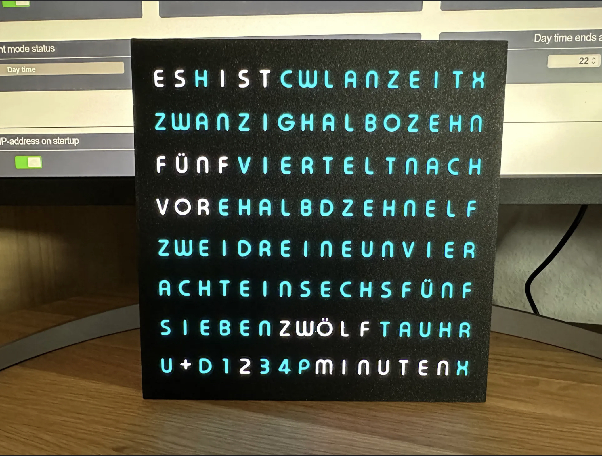
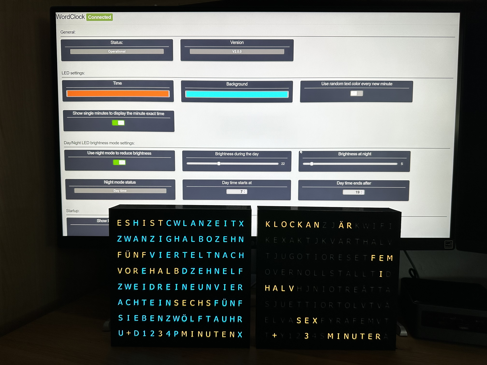
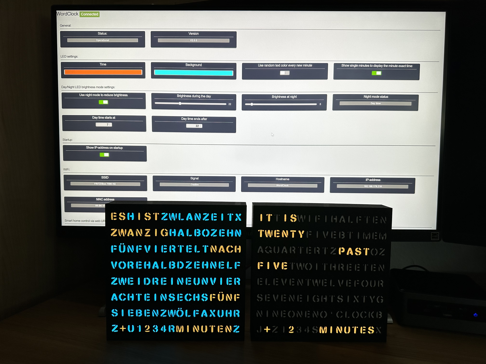
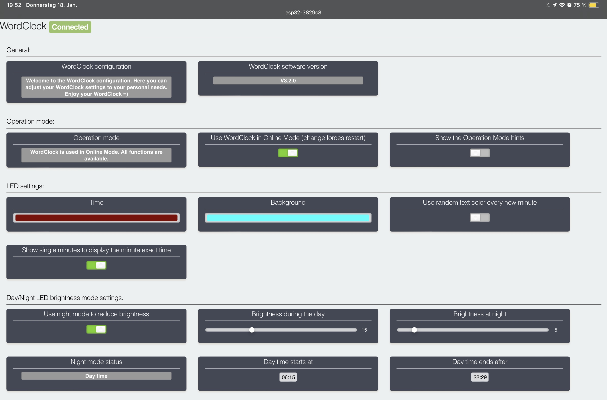
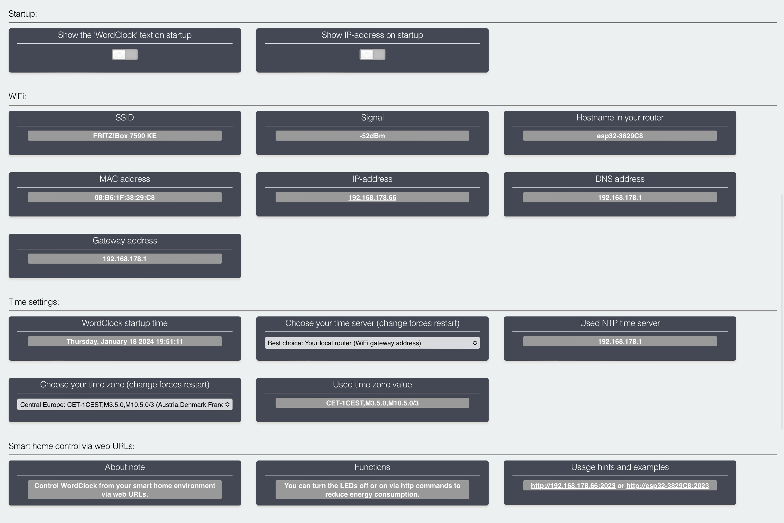
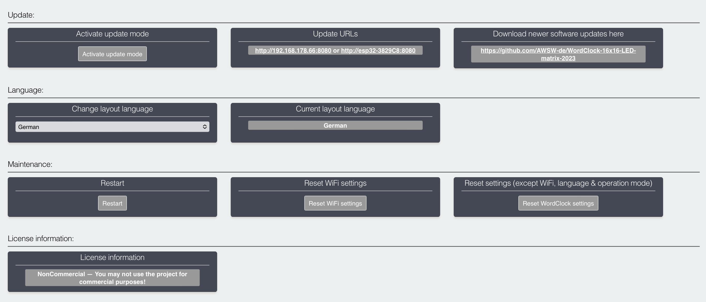
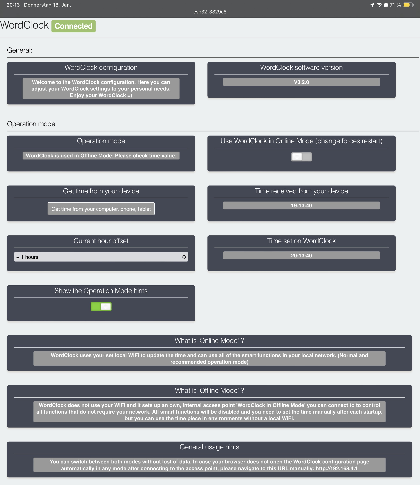
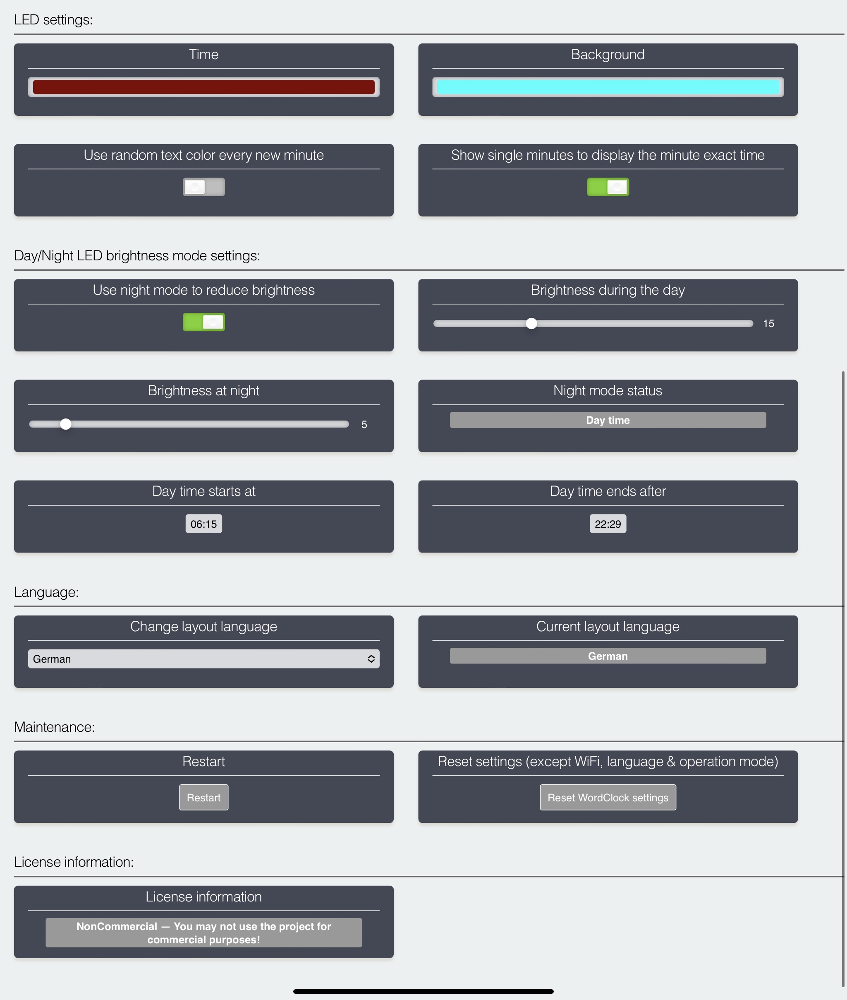

# WordClock-16x16-LED-matrix-2023 

WordClock 16x16 LED matrix (2023) in 3 design variants, super easy to print and build, 3 wires to solder only.

Code for the <a href="https://www.printables.com/de/model/350568-wordclock-16x16-led-matrix-2023-v1">WordClock 16x16 LED matrix (2023-V1)</a> and <a href="https://www.printables.com/de/model/361861-wordclock-16x16-led-matrix-2023-v2">WordClock 16x16 LED matrix (2023-V2)</a>  and <a href="https://www.printables.com/de/model/450556-wordclock-16x16-led-matrix-2023-v3">WordClock 16x16 LED matrix (2023-V3)</a> 3D print on <a href="https://www.printables.com">www.printables.com</a>

The designs are available in:
- German
- English
- Dutch
- Swedish
- Italian
- French
- Swiss German
- Chinese
- Swabian German
- Bavarian
- Luxemburgish 

This WordClock can be used in "Online Mode" with WiFi usage or in "Offline Mode" without the need of a local WiFi. In both modes you will be able to use an internal configuration portal to configure your WordClock. See pictures below. =)

Happy printing =)

Setup video instructions available for <a href="https://www.youtube.com/watch?v=BrVKY1sfZgI">Microsoft Windows 10/11</a> and <a href="https://www.youtube.com/watch?v=GptDFKhga0k">Apple macOS</a>.

 This work is licensed under a <a rel="license" href="http://creativecommons.org/licenses/by-nc/3.0/">Creative Commons Attribution-NonCommercial 3.0 Unported License</a>.

Images of 2023-V1 with stencil font and 2023-V2 and 2023-V3 with regular font:

WordClock in Online Mode:

WordClock in Offline Mode:

